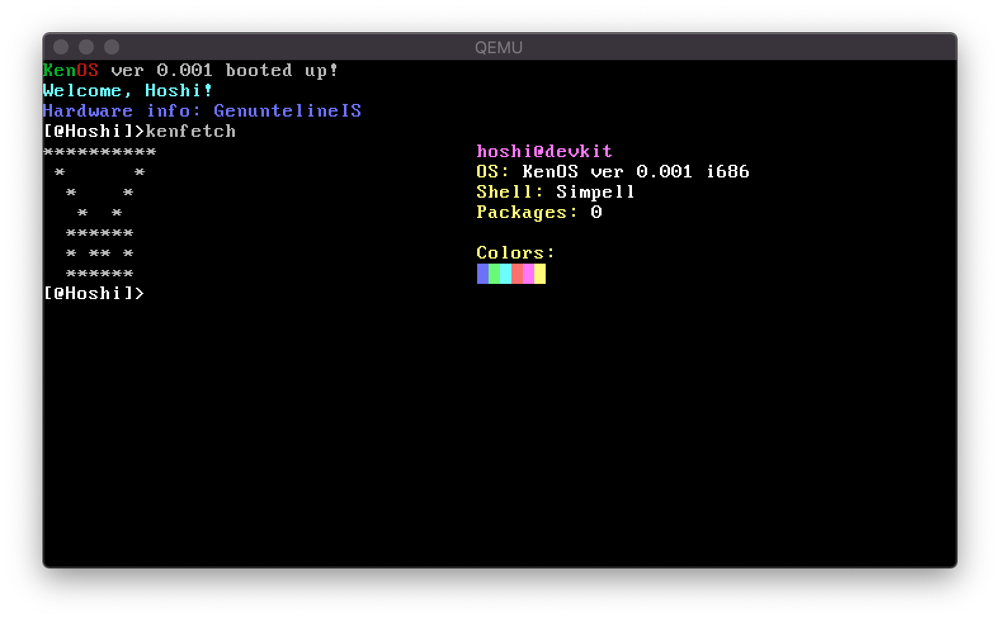

  

## Rework with better future of my previous operating system.

### What is purpose of this operating system?
I just want to learn osdev. Maybe I will not change the world, but...

I always wanted to be passionate programmer and never had motivation to do. I don't have it still, but there is a thing called *discipline*.

### How to compile it?
Simply use `make`. To cleanup, `make clean`.

### Mah I want it run too!
Use run script. You must install qemu-system-i386 as dependency.

### I don't want to compile whole toolchain!
Ok, understandable. Wait for release - I am also trying to prepare online build mechanism for my friends and in future alpha/beta testers.
